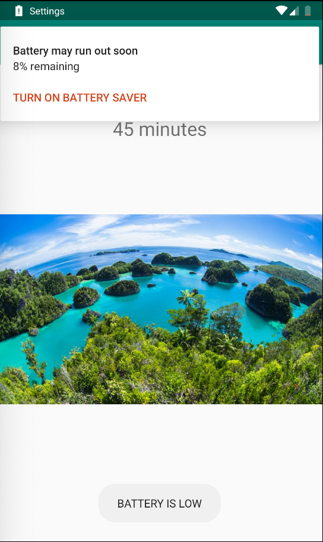
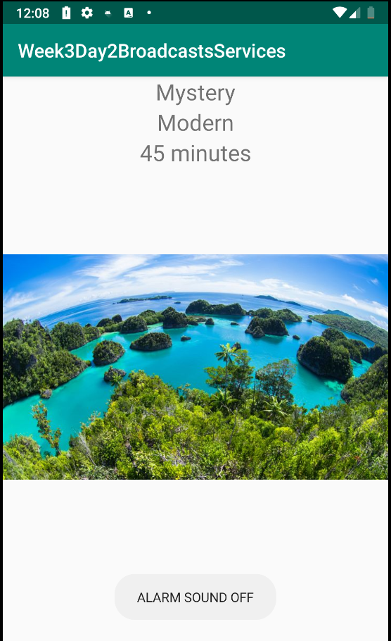

# Week3Daily4BroadcastsServices

## Five System Broadcast Message
I set up a BroadcastReceiver in the MainActivity and added the following to the IntentFilter.
- ACTION_AIRPLANE_MODE_CHANGE
- ACTION_POWER_CONNECTED
- ACTION_POWER_DISCONNECTED
- ACTION_BATTERY_LOW
- ACTION_HEADSET_PLUG

For each message that was receives a Toast was displayed.

## MusicForegroundService
This service aims to build a notification, use a MediaPlayer to play a song, and run the service as a foreground service with a notification.
I was able to get the song to play, however the notification did not show up when startForeground() was called. This service was left unfinished.

## RandomShowIntentService

This service has a method startRandomShows() to begin the Intent service. It creates 4 TelevisionShow Objects which instantiate randomly, adds them to an ArrayList, puts the ArrayList in a Bundle, then an Intent, and finally sends that intent through a broadcast message.
The MainActivity receives the Intent through onReceive, unpacks the Bundle, and passes the ArrayList to the a RecyclerView Adapter. A LayoutManager is created and both the LayoutManager and Adapter are passed to the RecyclerView within MainActivity.

### TelevisionShow.java
This simple Java object has 3 Strings and an int for member variables. The 3 Strings hold the genre, duration, and theme of the TelevisionShow, and the int stores the resource ID for the picture that depicts the setting of the show.
The default constructor does not take in any parameters but uses pre-defined arrays to generate random values for the member variables.

### RVShowsAdapter
This is a standard adapter to hold the data for the RecyclerView in MainActivity. The ViewHolder contains 3 TextViews and an ImageView and implements View.OnClickListener.

## Alarm Manager
The Alarm Manager was used in the onClick method in the ViewHolder class and sets an alarm when the a ViewHolder is clicked. The object that was clicked is passed into the Intent that is wrapped in the PendingIntent, however, once the broadcast message was received in MainActivity the object that was passing into the intent was not being pulled out.

## Work Manager Code Lab
The project that was worked on is included in the file.

   
